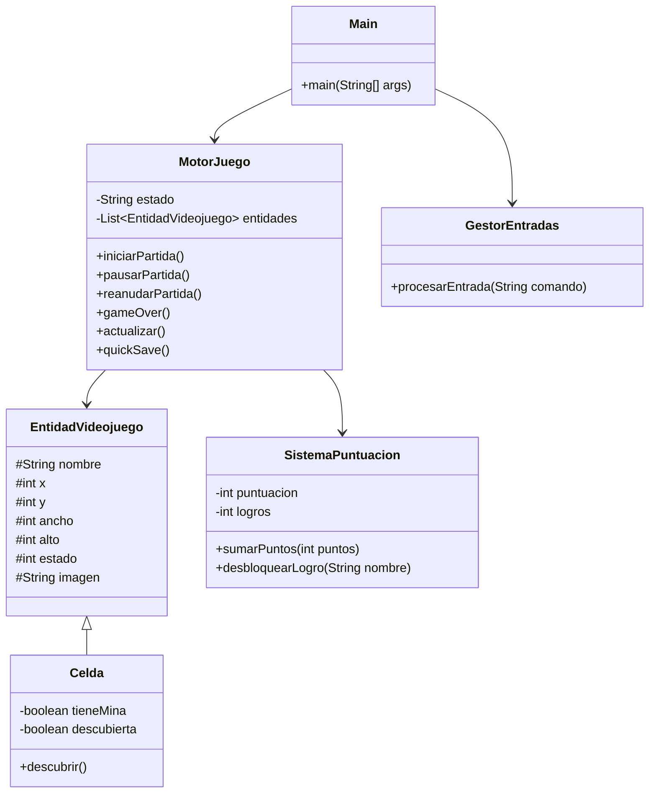
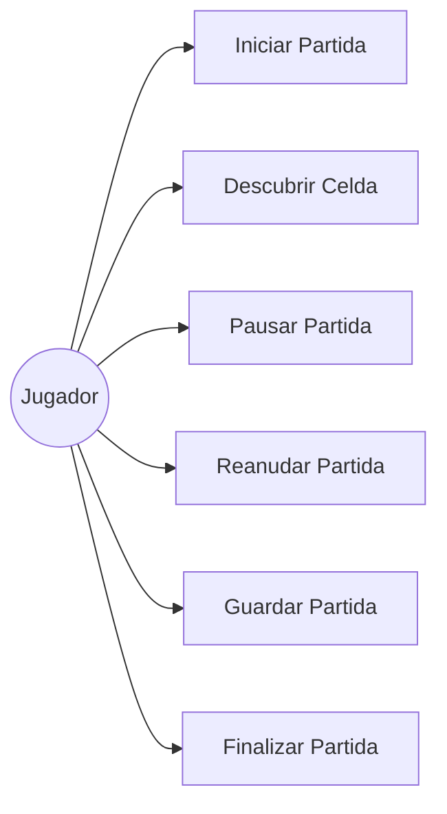

# Buscaminas Engine

Motor básico de un videojuego tipo Buscaminas desarrollado en Java mediante programación orientada a objetos.

## Temática Elegida

El proyecto simula la lógica interna de un videojuego tipo Buscaminas. El jugador descubre casillas de un tablero intentando evitar minas ocultas. El sistema gestiona estados de juego, puntuación, logros y guardado rápido.

## Arquitectura del Software

El sistema está compuesto por seis clases principales:

- Main: Simula el bucle de ejecución.
- MotorJuego: Controla el estado general de la partida.
- EntidadVideojuego: Clase abstracta base para las entidades.
- Celda: Representa una casilla del tablero.
- GestorEntradas: Simula las acciones del jugador.
- SistemaPuntuacion: Gestiona puntos y logros.

## Diagrama de Clases UML

## Diagrama de Casos de Uso UML

## Casos de Uso

### CU-01 Iniciar Partida

| Campo | Descripción |
|---------|---------|
| Nombre | CU-01 Iniciar Partida |
| Objetivo | Comenzar una nueva partida de Buscaminas. |
| Actor Principal | Jugador |
| Precondiciones | El juego debe estar en estado MENÚ. |
| Flujo Principal | 1. El jugador selecciona iniciar partida. 2. El sistema genera el tablero. 3. El estado cambia a JUGANDO. |
| Flujos Alternativos | Si ya existe una partida activa, se informa al usuario. |
| Postcondiciones | El tablero queda preparado para jugar. |
| Reglas de Negocio | No puede iniciarse una partida si ya hay una en curso. |

---

### CU-02 Descubrir Celda

| Campo | Descripción |
|---------|---------|
| Nombre | CU-02 Descubrir Celda |
| Objetivo | Descubrir una casilla del tablero. |
| Actor Principal | Jugador |
| Precondiciones | Debe existir una partida activa. |
| Flujo Principal | 1. El jugador selecciona una celda. 2. El sistema verifica si contiene mina. 3. Se actualiza el estado de la celda. 4. Se recalcula la puntuación. |
| Flujos Alternativos | Si la celda contiene una mina, se produce Game Over. |
| Postcondiciones | La celda queda marcada como descubierta. |
| Reglas de Negocio | Una celda descubierta no puede descubrirse nuevamente. |

## Bitácora de Uso de IA

Durante el desarrollo del proyecto se utilizó ChatGPT como herramienta de apoyo para:

- Generación de documentación técnica.
- Creación de diagramas UML en formato Mermaid.
- Resolución de dudas relacionadas con Git y GitHub.
- Revisión de estructura y organización del proyecto.

Todas las decisiones finales de diseño, implementación y validación fueron revisadas por el estudiante.