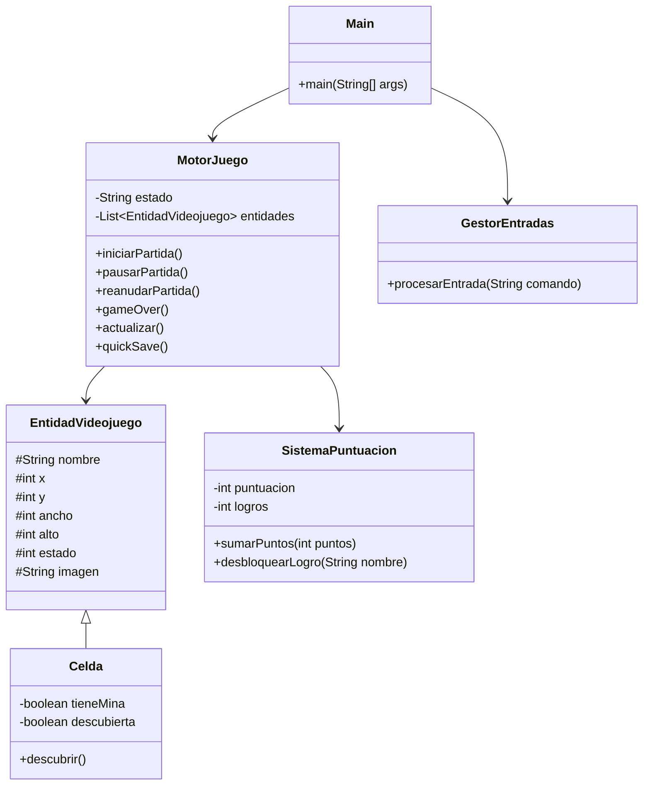
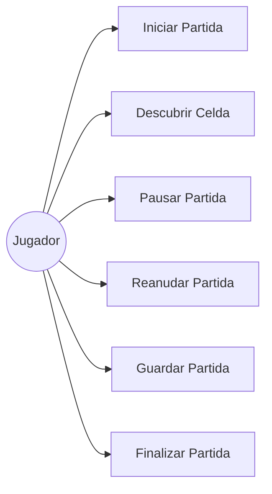

# Buscaminas Engine

Motor básico de un videojuego tipo Buscaminas desarrollado en Java mediante programación orientada a objetos.

## Temática Elegida

El proyecto simula la lógica interna de un videojuego tipo Buscaminas. El jugador descubre casillas de un tablero intentando evitar minas ocultas. El sistema gestiona estados de juego, puntuación, logros y guardado rápido.

## Arquitectura del Software

El sistema está compuesto por seis clases principales:

- Main: Simula el bucle de ejecución.
- MotorJuego: Controla el estado general de la partida.
- EntidadVideojuego: Clase abstracta base para las entidades.
- Celda: Representa una casilla del tablero.
- GestorEntradas: Simula las acciones del jugador.
- SistemaPuntuacion: Gestiona puntos y logros.

## Diagrama de Clases UML

## Diagrama de Casos de Uso UML

## Casos de Uso

(Pendiente)

## Bitácora de Uso de IA

(Pendiente)